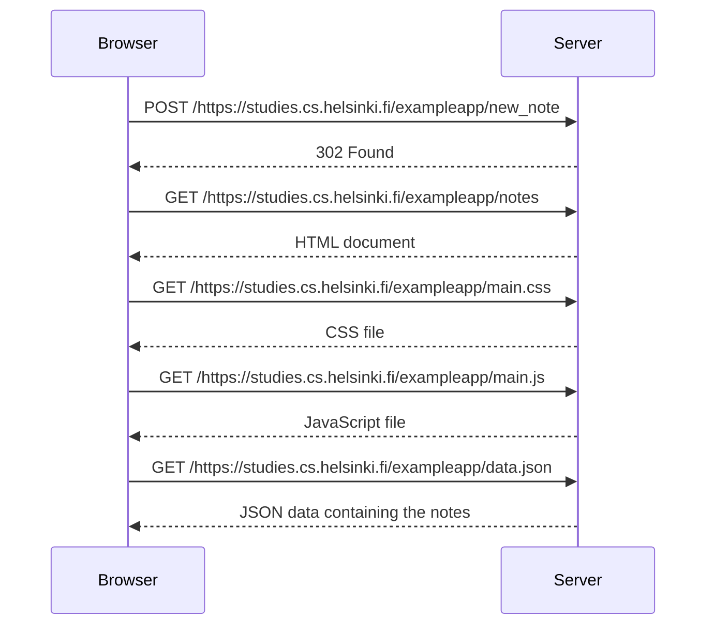

# Part 0 - 0.4

```mermaid
sequenceDiagram
    participant browser as Browser
    participant server as Server

    browser->>server: POST /https://studies.cs.helsinki.fi/exampleapp/new_note
    server-->>browser: 302 Found

    browser->>server: GET /https://studies.cs.helsinki.fi/exampleapp/notes
    server-->>browser: HTML document

    browser->>server: GET /https://studies.cs.helsinki.fi/exampleapp/main.css
    server-->>browser: CSS file

    browser->>server: GET /https://studies.cs.helsinki.fi/exampleapp/main.js
    server-->>browser: JavaScript file

    browser->>server: GET /https://studies.cs.helsinki.fi/exampleapp/data.json
    server-->>browser: JSON data containing the notes
```